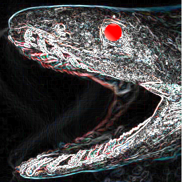
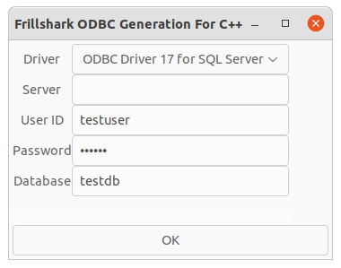

# Frillshark  
  
このプログラムは、C++ での 「ODBC」接続を補助します。  
This program assists in connecting to ODBC For C++  
Use gtkmm3.0 Lunux GUI Application
  
## 01. Configuration  
 必要パッケージ  
 ODBC の セットアップ  
   
 Microsoft のODBCページを参照の上セットアップ、  
 https://docs.microsoft.com/ja-jp/sql/connect/odbc/linux-mac/installing-the-microsoft-odbc-driver-for-sql-server?view=sql-server-ver15  
または各ディストリビューション標準のセットアップ  
libodbc.so,環境ファイル（odbc.ini,odbcinst.ini）をセットアップ  

gtk3.0,gtkmm3.0  
  
## 02. SetUp
$ ./bld.sh  

## 03. Execute (Frillshark)  
  
### Driver:選択子がなければセットアップをやり直してください。  
### server:サーバー名かIPアドレスを入力してください。  
### User ID:ユーザー名  
### Password:パスワード  
Database:C++のclassを作成するデータベース  
### [OK]ボタン   
ボタンをクリックするとファイル保存用ダイアログが表示されますので  
ファイル名を入力してください。  

## 04. Example  
例として"testdb"のクラスを作成します。
testdbが存在する場合、"testdb.hpp","odbccommon_testdb.hpp" を
作成します。（ファイル名は保存ダイアログで指定した名称）  

## 備考  
cmakeで Make を使う設定から Ninja を使う設定に変えました  
".vscode/settings.json"で  
"cmake.generator": "Unix Makefiles" から  
"cmake.generator": "Ninja" へ変更しました。  
